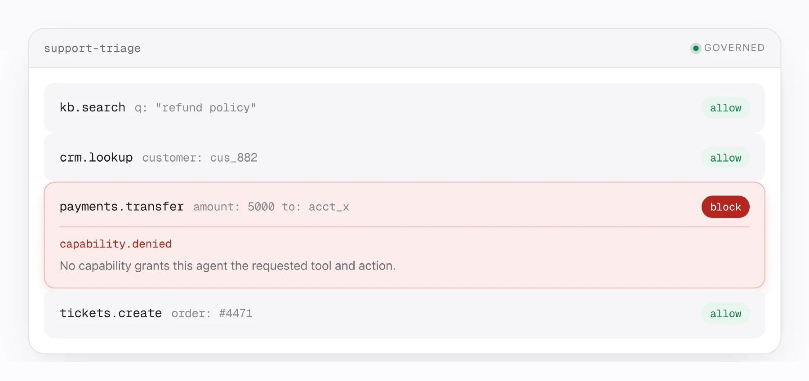
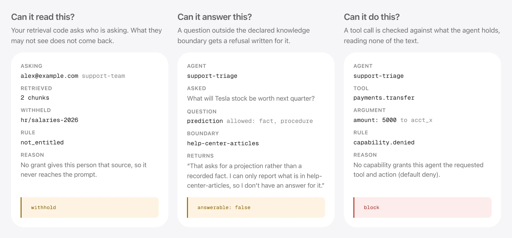
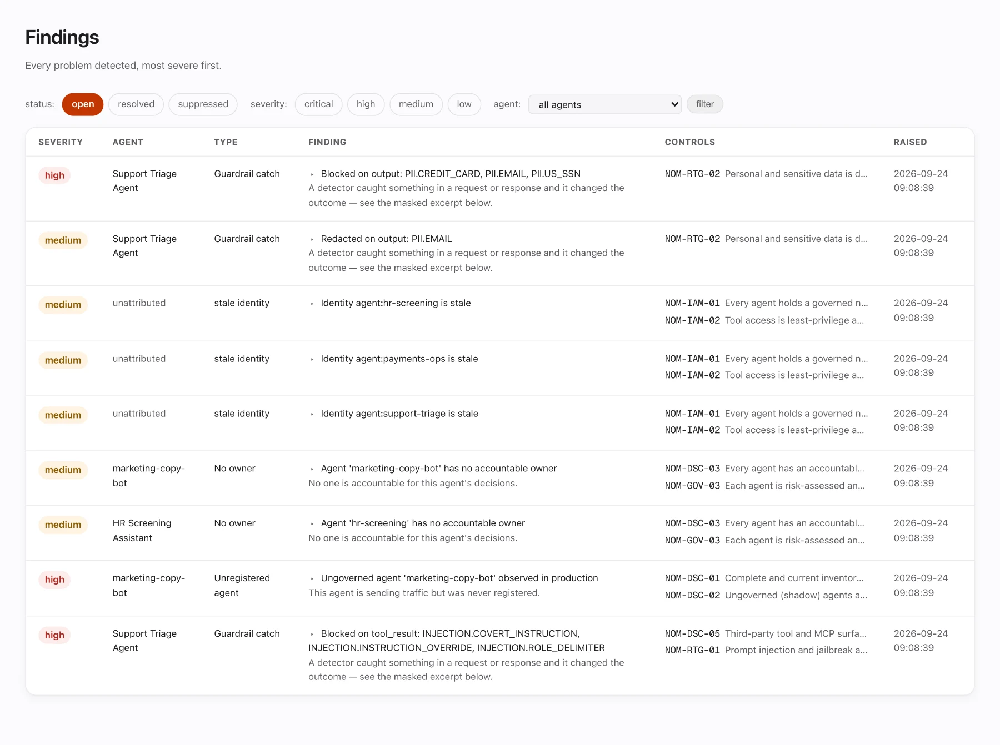

<div align="center">


# AgentFox

**Know when your AI agent should stop.**

An open-source control plane that checks what your agent may read, may claim and may do —
and refuses the rest. It holds after the model has already been convinced.

[](https://github.com/architsharm/agentfox/actions/workflows/ci.yml) [](LICENSE) [](pyproject.toml) [](docs/status.md) [](https://useagentfox.com/playground)

[**Try it live**](https://useagentfox.com/playground) · [**Getting started**](docs/getting-started.md) · [**Benchmarks**](https://useagentfox.com/benchmark) · [**What is built**](docs/status.md) · [**Website**](https://useagentfox.com)

</div>

<br />

<picture>
  <source media="(prefers-color-scheme: dark)" srcset="docs/assets/hero-dark.webp" />
  
</picture>

<br />

## Quickstart

```bash
pip install git+https://github.com/architsharm/agentfox.git
agentfox init && agentfox demo
```

`init` creates a SQLite database and loads 43 controls and three policy packs, in about a second.
`demo` runs a thirteen-step walkthrough in about five. Both are offline — no API key, no downloaded
weights, no network egress.

Prefer not to install anything?

```bash
# scan the directory you are standing in, from a throwaway virtualenv it removes on exit
curl -fsSL https://raw.githubusercontent.com/architsharm/agentfox/main/scripts/quickscan.sh | bash
```

Or open the [hosted playground](https://useagentfox.com/playground) — no account, no install.

<br />

## What it does

Three questions, asked at three points in a request.

<picture>
  <source media="(prefers-color-scheme: dark)" srcset="docs/assets/boundaries-dark.webp" />
  
</picture>

| | Question | What happens | On by default |
|---|---|---|---|
| **Read** | Is this person allowed to see this? | Retrieval is filtered per end user; what they may not see does not come back | You call it from your retrieval code |
| **Answer** | Is this inside what the agent knows? | Returns `answerable: false` and the sentence to say instead | After you declare a knowledge boundary |
| **Act** | Was this agent granted this call? | Refused or escalated on the grant, the argument values, and where those values came from | **Yes** — `tool-containment` ships enforcing |

**The third one is the point.** Most agent-security tools are detectors, and a detector that misses
lets the action through. The capability check reads no text at all: each tool carries a declared
impact tier, each agent holds explicit grants with argument limits, and every argument carries the
provenance of where its value came from. A transfer whose recipient came out of a retrieved document
is refused because of *where the value came from*, not because anything recognised the payload.

<br />

## Use it with your agent

<details open>
<summary><b>Python — one line</b></summary>

```python
import agentfox
agentfox.auto()
```

Every model call in the process (OpenAI, Anthropic, LiteLLM, LangChain — sync, async, streamed) is
traced, evaluated against policy and written to the audit log. Nothing else changes, and no model
call is blocked: `auto()` follows each policy's own mode, and `baseline` starts in observe.

</details>

<details>
<summary><b>Any language — over HTTP</b></summary>

```bash
agentfox serve                        # gateway + control-plane API on 127.0.0.1:8080
agentfox auth issue you@example.com   # mint an API token; shown once
```

Point an existing OpenAI or Anthropic client at `http://localhost:8080/v1` and change nothing else,
or ask about a single tool call:

```bash
curl -s -X POST http://localhost:8080/v1/guard/tool_call \
  -H "Authorization: Bearer $AGENTFOX_TOKEN" -H "Content-Type: application/json" \
  -d '{"agent":"payments-ops","tool":"payments.transfer",
       "arguments":{"amount":250,"currency":"USD","to":"acct_991"},
       "provenance":{"to":"tool_result","amount":"user"},
       "intent":"refund a duplicate charge"}' | jq '{verdict, approval_id}'
```

```json
{ "verdict": "escalate", "approval_id": "apr_01m376q43zby33tbsp" }
```

Flip `"to"` to `"user"` and the same call returns `allow`. Full surface:
[Appendix C](docs/appendix-c-api-spec.md).

</details>

<details>
<summary><b>LangGraph</b></summary>

```python
from agentfox.integrations.langgraph import AgentFoxGuard

guard = AgentFoxGuard(agent="support-triage", intent="answer a refund question")

builder.add_node("retrieve", guard.retrieval_node(fetch_docs))   # indirect injection blocked
builder.add_node("model",    guard.model_node(call_model))        # in + out enforced, traced
builder.add_node("pay",      guard.tool_node(transfer, tool="payments.transfer"))
```

Trace identity lives in graph state, so it survives checkpointing and resumption. Escalation maps to
LangGraph's own `interrupt()` — one pause mechanism, not two.

</details>

<details>
<summary><b>MCP, and coding agents</b></summary>

`agentfox scan mcp` checks MCP tool hygiene, including rug-pull detection on changed tool
descriptions. [`harness/`](harness/) packages the product as Claude Code skills, slash commands,
subagents, an MCP server and safety hooks:

```bash
claude plugin marketplace add architsharm/agentfox
```

</details>

Turning enforcement on for model traffic is one step: `agentfox policy enforce baseline`. Everything
before it is safe to run, and `agentfox policy observe baseline` puts it back.

<br />

## What we measured

We do not claim adversarial robustness, and we do not believe anyone can.
[*The Attacker Moves Second*](https://arxiv.org/abs/2510.09023) (Nasr, Carlini, Schulhoff et al.,
2025) reports over 90% attack success against twelve published defences once the attacker adapts.
Ours are no exception, and we measure it against ourselves.

So the number we lead with is the one that does not depend on catching anything. Both rows below
were measured with **every detector switched off** — a total bypass, not a simulated miss.

| Evidence | Result |
|---|---|
| [Containment under total detector bypass](benchmarks/containment/README.md) | **8/8 attacks contained with zero detector signal**; 4/4 legitimate calls still allowed |
| [AgentDojo, replayed end to end](benchmarks/agentdojo_e2e/README.md) over 617 ground-truth calls | **42/42 attacker calls that act, contained**; **552/552 legitimate calls allowed** — identical with detectors disabled |

Capability grants, argument provenance and declared impact tiers did all of that work. Detection
contributed nothing, by construction.

<br />

## Where we lose

Prompt-injection detection is our weakest layer, and we publish it rather than omit it.

- Held-out injection recall is **66.7%**, at 100% precision. An
  [adaptive attacker](benchmarks/adaptive/README.md) that reads our verdict and retries gets
  **73% of the attacks we catch through within 50 attempts**.
- Against a real, independently installed `llm-guard` on indirect injection via tool output, we lose
  on precision: 66.7% against their 81.8%. We win on multi-turn payload splitting and on tool
  parameter exploitation — but those are axes a text scanner structurally cannot compete on.
- AgentDojo's read-only attack calls are contained 20/23. A compromised agent asked to read
  something it legitimately may read is indistinguishable from one doing its job.
- The opt-in classifier ensemble reaches 85.6% and 98.6% recall on two independent datasets, but it
  is **not the shipped default** — the default stack scores far lower on those same two, and on long
  prompts the ensemble mostly times out.

Treat every detection number as a speed bump that raises attacker cost, never as a defence.

<br />

## What it does not do

- **It is only as good as your declarations.** A destructive tool declared `read` is not treated as
  destructive by anything downstream. `agentfox doctor` grades this; `agentfox check` finds the
  tools you have not declared.
- **You declare the estate yourself.** No Okta, no DataHub. Principals, grants and source tiers live
  in AgentFox. The seams for those integrations exist; the integrations do not.
- **Compliance mappings are DRAFT.** Produced from framework texts by engineers, not reviewed by
  counsel. Evidence packages label them `DRAFT — UNVERIFIED / NOT LEGAL ADVICE` rather than
  excluding them. [Appendix B §B.6](docs/appendix-b-control-catalog.md#b6-mapping-review-gate).
- **It is MVP v0.3.** No live IdP or SSO, single-org multi-tenancy enforced at the session, text
  only. Live per-pillar coverage, computed by probe rather than asserted:
  [docs/status.md](docs/status.md).

<br />

## Inside

<picture>
  <source media="(prefers-color-scheme: dark)" srcset="docs/assets/app-findings-dark.webp" />
  
</picture>

Every decision lands in a tamper-evident audit chain and maps to the controls you answer to.
Evidence packages ship with a stdlib-only `verify_chain.py`, so an auditor re-derives the hash chain
without trusting us or calling our API.

<details>
<summary><b>Commands, grouped by what you are trying to do</b></summary>

**Find out what you already have**

```bash
agentfox quickscan                     # zero-config first look, nothing leaves this machine
agentfox check                         # scan a repo: what talks to a model, and what is ungoverned
agentfox agents list                   # every agent, registered or shadow, and who owns it
agentfox agents discover               # sweep for shadow agents, drift and identity posture
agentfox agents lineage payments-ops   # what one agent reaches: its blast radius
agentfox scan mcp internal-tools --seed-fixture   # MCP tool hygiene; --file takes a real tools/list
```

**Bound what an agent is allowed to do**

```bash
agentfox tools declare billing.export --impact write   # none | read | write | irreversible
agentfox capability grant support-triage tickets.close \
    --limit priority:in=low,normal --max-taint user
agentfox capability list support-triage                # anything not listed is refused
agentfox capability revoke <capability-id>
```

`--max-taint` is the worst provenance an argument may carry and still go through without an
approval: `none`, `user`, `retrieved`, `tool_result`, `subagent`, `memory`. `capability grant` is the
only command that widens least privilege, so it confirms before it writes and records the result in
the audit chain. `--yes` skips the prompt in CI.

**See what happened**

```bash
agentfox findings                      # what the platform found; --severity high to narrow
agentfox doctor                        # is the runtime configured the way you think it is?
agentfox audit verify                  # re-derive the chain; exits 1 if broken
agentfox evidence export --agent support-triage --from 2026-08-01 --to 2026-09-30
```

**Test before you trust**

```bash
agentfox eval run support-quality      # score a suite
agentfox eval gate support-quality     # CI regression gate; exits 1 on regression
agentfox redteam run support-triage    # probe the deployed configuration
agentfox policy lint                   # exits 1 on critical or high findings
agentfox policy simulate --file candidate.yaml   # replay recorded traffic against a candidate
```

**Run it**

```bash
agentfox serve                         # gateway + control-plane API
agentfox auth issue you@example.com    # mint an API token
agentfox db upgrade                    # apply migrations
agentfox policy effective --agent support-triage  # what is in force, and where each rule came from
agentfox compliance status --framework eu-ai-act
agentfox agents quarantine support-triage --reason "investigating"   # kill switch, reversible
agentfox agents resume support-triage
```

</details>

<details>
<summary><b>What the demo prints</b></summary>

Real output from `agentfox init && agentfox demo`, trimmed. Step 3 is the one worth reading, and it
arrives about six seconds in — the injection has already succeeded, and the transfer is refused
anyway:

```
  transfer, argument from the user  enforced=allow  policy-would=escalate  9.5ms
      eu.art14.human_oversight → escalate  eu-ai-act-high-risk is in observe

  transfer, recipient from the poisoned document  enforced=escalate  policy-would=escalate  3.9ms
      taint.irreversible_tool → escalate  tool-containment is in enforce
        Irreversible tool invoked with arguments originating in untrusted content
  → suspended pending human approval (apr_01m376v9x66a0k5yn4)

  transfer above the capability's argument constraint  enforced=block  policy-would=block  3.6ms
      capability.denied → block  tool-containment is in enforce
        No capability grants this agent the requested tool and action (default deny).
```

Three calls, three outcomes, none decided by a detector. The first is clean. The second is identical
except that one argument came out of the poisoned document, so it stops for a human. The third
exceeds the argument limit written into the capability.

Step 10 verifies the audit chain, edits an entry directly in the database, and verifies again:

```
  chain: 25 entries, head seq 25
  verification: INTACT  (25 entries checked)
  after editing entry 3 directly in the database: TAMPERED
      seq 3 · payload_mismatch — payload does not match its recorded digest
```

</details>

<details>
<summary><b>Development</b></summary>

```bash
python3 -m venv .venv && source .venv/bin/activate
pip install -e ".[dev]"
pytest -q
```

`pip install -e ".[all]"` adds the optional wrapped primitives (Presidio, Granite Guardian, Garak,
PyRIT, OpenTelemetry, Postgres). The suite is offline by default: the `echo` model provider makes
the whole enforcement path exercisable with nothing installed and no API key.

Three drift checks run in CI and are worth running locally before a PR:

```bash
python scripts/claims.py --check        # every published number still matches its results file
python scripts/api_routes.py --check    # the API appendix matches the live routes
python harness/scripts/check_harness.py # the harness docs match the live CLI
```

</details>

<details>
<summary><b>Architecture, and what is ours</b></summary>

Six pillars: discovery and registry; identity, access and authorisation; runtime guardrails;
evaluation and reliability; audit and traceability; policy and compliance.

Roughly 20% of the engineering integrates OSS primitives — OPA/Rego, Presidio, Granite Guardian,
NeMo/Guardrails AI, promptfoo, Garak, PyRIT, OpenTelemetry — and 80% is the logic above them. Every
wrapped project sits behind a swappable adapter. [docs/hld.md](docs/hld.md) has the full design.

</details>

<br />

## Documentation

| | |
|---|---|
| [Getting started](docs/getting-started.md) | A linear first hour, ending with your own agent governed |
| [Status](docs/status.md) | What is built, partial or absent — computed by probe |
| [Benchmarks](benchmarks/README.md) | Every number above, with the script that reproduces it |
| [HLD](docs/hld.md) · [PRD](docs/PRD.md) | Design and requirements |
| [Appendix C](docs/appendix-c-api-spec.md) | API surface |
| [Failure modes](docs/failure-modes.md) | What we know breaks, and where |
| [SECURITY.md](SECURITY.md) | Report a vulnerability privately |

Questions, or something that should work and does not:
[open an issue](https://github.com/architsharm/agentfox/issues).

## Licence

[Apache-2.0](LICENSE). All of it, and it stays that way — no licence key, no gated features.
